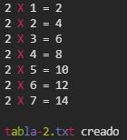
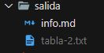

# Notas
<ul>
    <li>Esta es una app de consola realizada con Node.js</li>
    <li>Opciones y Validaciones de consola realizadas con <a href="https://www.npmjs.com/package/yargs"> 'yargs'</a></li>
    <li>Dentro de la carpeta 'salida', realizo escritura en disco del resultado en un 'tabla-${base}.txt' con una libreria de <a href="https://nodejs.org/dist/latest-v14.x/docs/api/fs.html">FileSystem de Node: 'fs'</a> y la función: <a href="https://nodejs.org/dist/latest-v14.x/docs/api/fs.html#fs_fs_writefilesync_file_data_options">'writeFileSync'</a></li>
    <li>Muestro por consola el resultado con detalles en colores utilizando el paquete <a href="https://www.npmjs.com/package/colors"> 'colors'</a></li>
  </ul>

# Ejemplo - Tabla de multiplicar Base = 2
 <p>Para el comando: <bold>node app --base=2 --hasta=7 --listar </bold>
 <br>
 <br>
 obtenemos por consola:
 <br>
 
 <br>
 <br>
 El resultado tambien es almacenado en disco:
 <br>
 
 <br>
 <br>
 </p>
<br>

#  Con el paquete 'yargs' se configuran las siguientes opciones:
<br>

```
Opciones:
      --help     Muestra ayuda                                        [booleano]
      --version  Muestra número de versión                            [booleano]
  -b, --base     Base de la tabla de multiplicar            [número] [requerido]
  -l, --listar   Muestra la tabla en consola         [booleano] [defecto: false]
  -h, --hasta    Indica hasta donde será la tabla         [número] [defecto: 10]
```